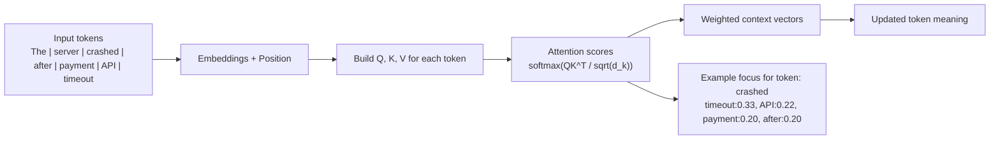
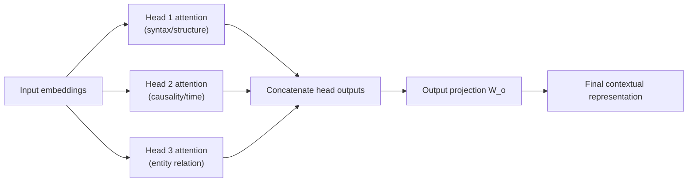

# Architecture of Transformers - Interview Notes (Senior GenAI Engineer POV)

## 1) How I Explain Transformer Architecture in Interviews

When I explain transformer architecture, I start from the problem it solved: RNN/LSTM pipelines struggled with long-range dependencies and poor parallelism. Transformers replaced recurrence with self-attention, which lets every token directly attend to every other token in the same sequence.

### Classroom-style intuition (human task analogy, English only)

Think of a sentence as a team in a project room. Each word is one team member:
`The | server | crashed | after | payment | API | timeout`

In older sequential models, information is passed person-to-person in a line. By the time it reaches the end, some details weaken.

In a transformer, everyone is in one live meeting. Any member can listen to everyone else instantly.

- `crashed` asks: "Who explains why this happened?"
- `timeout` responds with strong relevance.
- `payment` and `API` add domain context.
- `after` adds time order.

So the meaning of `crashed` is updated using the most relevant teammates in one step.

How I explain Q, K, V in this analogy:
- **Query (Q):** What information am I looking for?
- **Key (K):** What type of information do I contain?
- **Value (V):** What actual information can I contribute?

Self-attention is the matching process:
each word's query compares against all keys, then collects weighted values.

Why multi-head attention helps:
it is like having multiple expert teachers in the same class:
- one focuses on grammar/structure,
- one on cause-effect,
- one on domain/entity links.

Their perspectives are combined, giving richer understanding than a single viewpoint.

### Classroom Analogy (Human Task View) - Hindi+English Mix (Fast Recall)

Socho sentence ek classroom project team hai:
`The | server | crashed | after | payment | API | timeout`

Yahan har word ek student hai.

- Old RNN/LSTM style: ek student se next student tak note pass hota hai (sequential), beech me context weak ho sakta hai.
- Transformer style: sab students ek round-table discussion me hain, sab ek doosre ki baat sun sakte hain at the same time.

Ab token `crashed` ko samajhna hai ki issue kya hai:
- wo poochta hai: "Mere liye kaun relevant hai?"
- `timeout` bolta hai: "Main cause bata raha hoon."
- `payment` + `API` bolte hain: "Hum domain context de rahe hain."
- `after` bolta hai: "Main timeline/sequence clear kar raha hoon."

Final meaning: `crashed` becomes "payment API timeout related crash", not generic crash.

QKV ko class language me yaad rakho:
- **Q (Query):** Mujhe kya samajhna hai?
- **K (Key):** Mere paas kis type ki info hai?
- **V (Value):** Main actual kya contribution de raha hoon?

Self-attention ka simple rule:
"Har word sab words ko score karta hai, phir weighted important context lekar apni understanding update karta hai."

Multi-head ko aise yaad rakho:
- Head 1: grammar teacher (structure)
- Head 2: logic teacher (cause-effect)
- Head 3: domain teacher (API/payment relation)

Sab teachers ka output combine hota hai, isliye final understanding richer hoti hai.

Interview one-liner (Hinglish):
"Transformer me har token ek smart student ki tarah sabse poochta hai, jo important ho uski baat weight dekar sunta hai, aur multi-head se multiple expert views combine karke final meaning banata hai."

Quick visualization I use in interviews:  
For the sentence `"The server crashed after the payment API timeout"`, the token `crashed` can directly look at `payment`, `API`, and `timeout` in one attention step (not after many sequential steps). At the same time, `timeout` can also attend to `crashed` and `after`, so the model links cause and effect quickly. Think of it like every word joining the same meeting and listening to all other words, but with different attention weights.

Simple attention chart (example weights):

| Query token \\ Key token | crashed | payment | API | timeout | after |
|---|---:|---:|---:|---:|---:|
| **crashed** | 0.05 | 0.20 | 0.22 | 0.33 | 0.20 |
| **timeout** | 0.28 | 0.18 | 0.16 | 0.08 | 0.30 |

How to read this quickly:
- In row `crashed`, the highest weight is on `timeout` (0.33), so `crashed` strongly uses `timeout` context.
- In row `timeout`, high weights on `after` and `crashed` help encode temporal cause-effect.
- Each row sums to around `1.0` after softmax, so weights are a probability-like distribution.

Diagram in my mind (single self-attention flow):



Mini multi-head visualization (same sentence, different heads learn different things):

| Head | Learned focus | Strong attention pattern (example) | What it captures |
|---|---|---|---|
| **Head 1** | Syntax / structure | `crashed -> server`, `timeout -> API` | Who did what (event-object relation) |
| **Head 2** | Causality / time | `crashed -> timeout`, `timeout -> after` | Why/when event happened |

Quick interview line:
"One head understands sentence structure, another head captures cause-effect. Their outputs are concatenated, so the model gets both views at the same time."

Diagram in my mind (multi-head flow):



Core blocks I cover:

1. Input Embedding + Positional Encoding  
   - Token embeddings convert discrete tokens into dense vectors.  
   - Positional encoding (learned or sinusoidal) injects order information because attention alone is permutation-invariant.

2. Multi-Head Self-Attention  
   - For each token, model creates Query, Key, Value vectors.  
   - Attention scores are computed using scaled dot-product attention:
     Attention(Q, K, V) = softmax(QK^T / sqrt(d_k))V  
   - Multiple heads learn different relationships in parallel (syntax, semantic dependencies, entity links, etc.).

3. Feed-Forward Network (FFN)  
   - Position-wise MLP transforms each token representation independently after attention mixing.

4. Residual Connections + Layer Normalization  
   - Stabilize training and improve gradient flow in deep stacks.

5. Encoder/Decoder Stacking  
   - Encoders build contextual representations.  
   - Decoders generate outputs autoregressively and use masked self-attention.

### Use case on real data — how each architecture step acts on a ticket (visual mental model)

**Real input sentence (support ticket):**  
`"Customer cannot reset login after billing update."`

**Assume tokenization (illustrative subwords):**  
`[CLS]`, `Customer`, `cannot`, `reset`, `login`, `after`, `billing`, `update`, `[SEP]`  

(Your tokenizer may split differently; the idea is the same: each piece becomes one row in the sequence.)

| Step | What happens on this real data | What to say in interview | How it works in backend |
|------|-------------------------------|---------------------------|-------------------------|
| **1. Embeddings** | Each token becomes a vector (e.g. 768-dim). Before the model runs, `"billing"` and `"login"` are just unrelated lookup vectors. | "Discrete IDs → dense vectors the network can mix." | Token IDs from the tokenizer are **integer tensors** `[batch, seq_len]`; an **embedding lookup table** (`nn.Embedding` or `gather` on a weight matrix) maps each ID to a row → float tensor `[batch, seq_len, d_model]`. Loaded once with model weights; runs on CPU/GPU as a large matrix read. |
| **2. Positional encoding** | Without this, shuffling tokens would give the same math; adding position makes `"after billing update"` ordered vs `"billing after update"`. | "Attention does not know order by itself; position encodings fix that." | **Element-wise add**: learned position vectors or fixed sinusoidal values broadcast to `[batch, seq_len, d_model]` and added to embeddings before layer 1. In code this is `x = embeds + pos`; compiler/fused kernels often merge with the first linear op for speed. |
| **3. Self-attention (one layer)** | Token `"cannot"` builds its **Q**; every token supplies **K** and **V**. High attention weights might link **`cannot` → `reset`, `login`** (negation + action) and also **`after` → `billing`, `update`** (temporal cause chain). Different **heads** can specialize: one head for negation scope, another for "billing" as domain hint. | "Each token asks: which other tokens should update my meaning? That is the attention map." | **Linear projections**: `Q = XW_q`, `K = XW_k`, `V = XW_v` (batched GEMMs). **Attention** = `softmax(QK^T / √d_k) V` — two big matmuls + softmax; on GPU via kernels (FlashAttention-style in prod for memory/latency). Output heads **concatenated** → `W_o` projection back to `d_model`. |
| **4. FFN (per token)** | After mixing, each position gets a small MLP. The vector at `"login"` is refined into "authentication issue" style features using information already blended from neighbors. | "Attention mixes information across positions; FFN processes each position independently." | Usually **two linear layers + activation** (e.g. GELU): `W_2 σ(W_1 x)` shape-wise `[d_model → 4×d_model → d_model]`. Implemented as **`nn.Linear` + op fusion**; same weights applied at every time step (parameter sharing), highly parallel on GPU along `seq_len`. |
| **5. Residual + LayerNorm** | `x_out = LayerNorm(x + sublayer(x))`. Prevents vanishing signal when the stack is deep. | "Residuals let the model pass raw signal forward; norm keeps activations stable." | **Tensor add** then **LayerNorm**: mean/var over last dim, scale/shift with `γ`, `β` — implemented as fused CUDA kernels in frameworks. **Pre-norm** variants do `Norm(Layer(x + sublayer(x)))`; checkpoints store these running stats only if batch norm (usually not in inference for LN). |
| **6. Stack of layers** | Layer 1 might capture local phrases ("cannot reset"); deeper layers combine into **intent**: e.g. "account access after billing change" → label **Access** or **Billing** cross-over. Final **`[CLS]`** vector feeds your classifier head. | "Early layers = local patterns; later layers = global task-level meaning." | **Repeated blocks** in a `for` loop or stacked modules; hidden state tensor flows `[batch, seq_len, d_model]` → last layer → **slice index 0** (`[CLS]`) → **`nn.Linear(d_model, num_classes)`** → **softmax/logits**. In serving: **ONNX/TensorRT/TorchScript**, batching, max length padding/masking, **KV-cache** for decoders; for encoder-only BERT-style, it's **single forward pass** per request. |

**One-sentence picture for whiteboard / interview:**  
"For this ticket, embeddings turn words into points in space; attention lets `cannot` pull meaning from `reset` and `login` in one hop; FFN sharpens each token's role; stacking builds the `[CLS]` vector we use to predict triage intent."

Interview line I use:  
"A transformer layer alternates between token-to-token communication (attention) and token-wise reasoning (FFN), with residual + normalization keeping optimization stable."

---

## 2) Working of Transformer (Practical, Step-by-Step)

### A) Encoder-only flow (example: BERT-style classification)
Think of encoder-only as: **"Read everything first, then decide."**

Flow diagram (mental model):
`Input text -> Embeddings+Pos -> (Encoder x N) -> CLS -> Classifier`

Step-by-step (human task view):
1. Tokenize text and create embeddings.
   - Human analogy: students get converted into “learnable cards” (token vectors).
   - Backend: tokenizer IDs -> `LongTensor [batch, seq_len]`, then `nn.Embedding` -> `FloatTensor [batch, seq_len, d_model]`.
2. Add positional signals.
   - Human analogy: seat numbers / ordering is attached so the model knows who came first and who came later.
   - Backend: `x = token_embeds + pos_embeds` (element-wise add) to make order available.
3. Pass through N encoder blocks.
   - self-attention (bidirectional): every token updates by attending to *all* other tokens.
   - FFN: each token refines its understanding with an MLP (still parallel across tokens).
   - Human analogy: each round, every student consults the entire class, then rewrites their notes.
4. Use final contextual embeddings for downstream task.
   - CLS token for classification (or token outputs for NER).
   - Human analogy: “the class captain” (CLS) collects the final class understanding and votes a label.
   - Backend: take final hidden state for `[CLS]` -> `Linear(d_model, num_labels)` -> logits/softmax.
Use case to explain in interview:  
"In a support-ticket triage system, I used an encoder model to classify tickets into Billing, Access, and Incident classes. Because encoder attention reads both left and right context, it handled phrases like 'not able to login after password reset' better than keyword rules."

### B) Decoder-only flow (example: GPT-style generation)
Think of decoder-only as: **"Write one word at a time, without peeking ahead."**

Flow diagram (mental model):
`Prompt -> (Decoder x N with causal mask) -> next token -> append -> repeat`

Step-by-step (human task view):
1. Input prompt tokens.
   - Human analogy: the student starts with the first lines they are allowed to see.
   - Backend: prompt IDs become the initial `[batch, seq_len]` input.
2. Masked self-attention ensures token t cannot see future tokens.
   - Human analogy: strict rule in an exam: you can only look left, not right.
   - Backend: apply a causal mask so attention logits for future positions are blocked.
3. Model predicts next token probability distribution.
   - Human analogy: the model proposes the “best next word” given what has been written so far.
   - Backend: hidden states -> vocabulary `Linear` head -> softmax probabilities.
4. Decode one token at a time (greedy, beam, top-k, nucleus, etc.).
   - Human analogy: after choosing one word, the student updates the paragraph and continues.
   - Backend: iterative generation; often uses KV cache to reuse past `K/V` tensors for speed.
Use case to explain in interview:  
"For an internal DevOps assistant, I used a decoder-only model to generate step-by-step runbooks from incident context. Autoregressive generation made it ideal for producing coherent multi-step instructions."

### C) Encoder-decoder flow (example: T5/BART translation/summarization)
Think of encoder-decoder as: **"Read the source, then write the target while citing the source."**

Flow diagram (mental model):
```text
Source -> Encoder -> Memory
Target so-far -> Decoder (causal self-attn + cross-attn to Memory) -> next token -> repeat
```

Step-by-step (human task view):
1. Encoder builds source representation.
   - Human analogy: teacher reads the entire document and prepares a structured memory.
   - Backend: encoder hidden states are computed from the source tokens.
2. Decoder uses:
   - masked self-attention on generated target tokens (left-to-right writing)
   - cross-attention over encoder outputs (grounding to the source)
   - Human analogy: the writer can’t look ahead in the target, but they can consult the teacher’s prepared notes.
   - Backend: decoder uses encoder outputs as `K/V` in cross-attention.
3. Generate target sequence autoregressively.
   - Human analogy: produce sentence-by-sentence until completion.
   - Backend: loop until EOS, usually with KV cache and careful length control.
Use case to explain in interview:  
"In compliance reporting, I used an encoder-decoder model to convert long audit notes into executive summaries. Cross-attention helped the decoder stay grounded in source content while generating concise output."

---

## 3) How Transformer Architecture Helped in My Projects

### Project 1: Enterprise Support Copilot (RAG Q&A over policy + ticket history)
- Problem: Old keyword/BM25 retrieval missed semantic variants and gave inconsistent answers.
- Transformer impact:
  - Used encoder transformers for semantic embeddings to improve retrieval recall.
  - Used decoder LLM for grounded answer generation with citations.
  - Better context understanding reduced hallucination and improved answer relevance.
- Business outcome:
  - Lower average handling time for support engineers.
  - Improved first-response quality and consistency.

### Project 2: Contract Intelligence Pipeline
- Problem: Rule-based extraction failed on wording variability across vendors.
- Transformer impact:
  - Fine-tuned encoder model for clause classification and risk tagging.
  - Added long-context chunking + cross-encoder re-ranking for precision.
- Business outcome:
  - Faster legal review cycles.
  - Better recall on non-standard clause language.

### Project 3: Multi-lingual Product Search
- Problem: Lexical search performed poorly across mixed-language catalogs.
- Transformer impact:
  - Bi-encoder multilingual embeddings for query-product matching.
  - Cross-encoder re-ranker for high-precision top results.
- Business outcome:
  - Better click-through on first-page results.
  - Improved relevance in multilingual traffic.

---

## 4) Types of Transformers and Why They Are Needed

### 1. Encoder-only Transformers (BERT, RoBERTa, DeBERTa)
- Need: Strong bidirectional context understanding.
- Best for: Classification, NER, semantic search embeddings, reranking.
- Why: They read full context at once; excellent for understanding tasks.

### 2. Decoder-only Transformers (GPT/Llama/Mistral family)
- Need: Natural language generation and instruction following.
- Best for: Chatbots, code generation, drafting, agentic reasoning pipelines.
- Why: Autoregressive objective aligns with text generation.

### 3. Encoder-Decoder Transformers (T5, BART, FLAN-T5)
- Need: Input-to-output transformation tasks.
- Best for: Summarization, translation, rewriting, structured generation.
- Why: Explicit source-target separation with cross-attention.

### 4. Long-context Transformers (Longformer, BigBird, modern long-context LLMs)
- Need: Handle long documents without aggressive truncation.
- Best for: Legal, compliance, research, log analysis.
- Why: Efficient attention patterns or optimized context windows.

### 5. Vision Transformers (ViT) and Multimodal Transformers (CLIP, LLaVA-like stacks)
- Need: Image + text understanding/generation.
- Best for: Document intelligence, visual QA, e-commerce media pipelines.
- Why: Shared representation space across modalities.

---

## 5) How I Select the Best Transformer (Industry Standard Decision Framework)

In interviews, I emphasize this is not "largest model wins", it is "fit-for-purpose under constraints".

### Step 1: Define task shape
- Understanding task (classify/retrieve) -> encoder-first.
- Generation task (answer/write/compose) -> decoder-first.
- Transformation task (source -> target) -> encoder-decoder.

### Step 2: Define constraints
- Latency SLA (P95/P99 targets)
- Throughput and concurrency
- Context length
- Data privacy/compliance (self-hosted vs API)
- Cost per 1K requests / per token

### Step 3: Build candidate shortlist
- Baseline small/medium/large models.
- Include domain-specific variants (biomedical, legal, code).

### Step 4: Offline evaluation
- Task metrics:
  - Classification: F1, AUROC
  - Retrieval: Recall@k, nDCG, MRR
  - Generation: groundedness, factuality, task success, human eval rubrics
- Robustness tests:
  - prompt variation, adversarial phrasing, OOD samples

### Step 5: Online validation
- A/B in shadow or canary mode.
- Track quality + latency + cost + safety incidents.

### Step 6: Operational readiness
- Observability (traces, token usage, retrieval hit quality)
- Guardrails (PII redaction, policy checks, output filters)
- Rollback strategy and versioned prompts/models.

Use case to explain selection in interview:  
"For a customer-support copilot, I benchmarked an encoder for retrieval quality and a decoder for answer generation. We selected the final stack only after it met Recall@5, groundedness, P95 latency, and cost-per-ticket targets in canary traffic."

Interview line I use:  
"I pick models by quality-to-cost ratio under production constraints, not leaderboard scores."

---

## 6) Best-Fit Scenario for Each Transformer Type

### Encoder-only best-fit scenario
Use case: Financial ticket triage and intent classification  
Why best fit: Needs high semantic understanding, low latency, and deterministic labels, not long-form generation.

### Decoder-only best-fit scenario
Use case: Internal engineering assistant that drafts runbooks and answers "how-to" questions  
Why best fit: Requires fluent multi-turn generation, instruction following, and tool-calling compatibility.

### Encoder-decoder best-fit scenario
Use case: Compliance report summarization from long policy documents into structured executive summaries  
Why best fit: Clear source-to-target transformation with controlled output style.

### Long-context transformer best-fit scenario
Use case: Legal due-diligence assistant over large contract bundles and appendices  
Why best fit: Must reason across long dependencies without losing cross-document references.

### Multimodal transformer best-fit scenario
Use case: Insurance claims processing from uploaded images + text claim descriptions  
Why best fit: Needs joint visual-text understanding for damage assessment and claim validation.

---

## 7) Interview-Ready Closing Summary

If asked "Why transformers?", my concise answer:

"Transformers became the industry default because self-attention gives superior context modeling with parallel training. In production, I choose encoder, decoder, or encoder-decoder variants based on task type, latency, cost, and compliance constraints. The best model is the one that meets business KPIs reliably in real traffic, not just benchmark scores."
